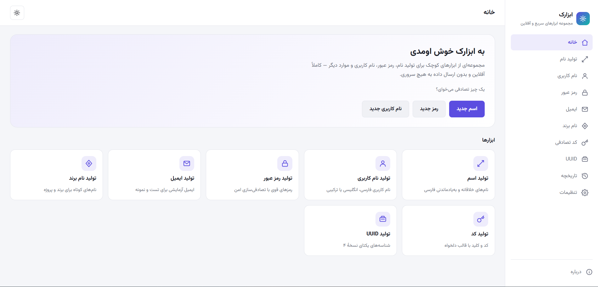
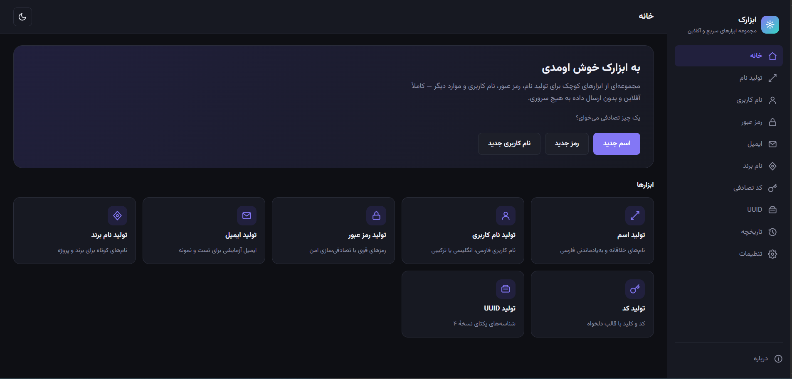
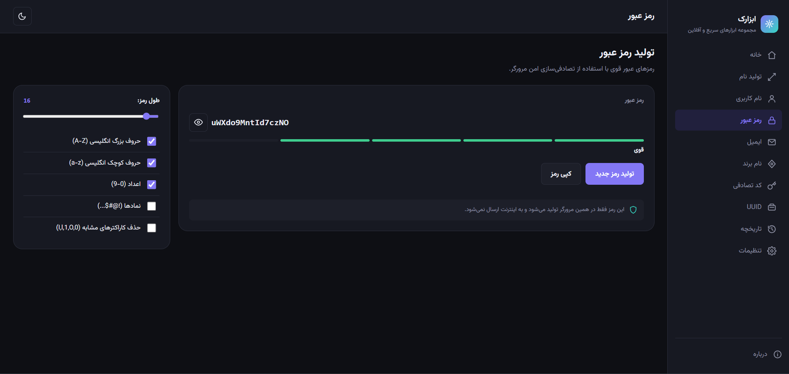
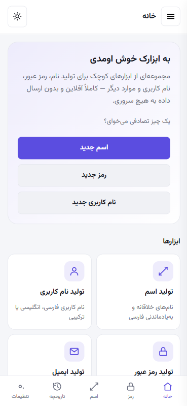

# ابزارک — مجموعه ابزارهای آفلاین فارسی

مجموعه‌ای از ابزارهای سریع، کاربردی و کاملاً آفلاین برای تولید نام، نام کاربری، رمز عبور، ایمیل آزمایشی، نام برند، کد تصادفی و UUID.

بدون سرور. بدون API. بدون ردیابی. همه‌چیز فقط در مرورگر شما اجرا می‌شود.

---

## 📸 پیش‌نمایش

---

## 🚀 دمو

این پروژه یک اپلیکیشن فرانت‌اند استاتیک است و می‌تواند به‌راحتی روی **GitHub Pages** میزبانی شود.

🔗 دموی زنده: `https://abolfazldev2022.github.io/Abzarak-toolkit/`

---

## 🧭 دربارهٔ پروژه

**ابزارک** یک جعبه‌ابزار وب فارسی و راست‌به‌چپ (RTL) است که چند تولیدکنندهٔ تصادفی پرکاربرد را در یک رابط واحد، سریع و مدرن جمع کرده — بدون این‌که هیچ داده‌ای از دستگاه شما خارج شود.

### چه مشکلی را حل می‌کند؟

معمولاً برای تولید یک اسم مستعار، نام کاربری، رمز عبور امن یا یک UUID، یا باید به چند سایت مختلف سر زد، یا از ابزارهایی استفاده کرد که داده‌های شما (از جمله رمز عبور!) را به یک سرور ارسال می‌کنند. ابزارک همهٔ این ابزارها را در یک صفحهٔ فارسی، سبک و **۱۰۰٪ آفلاین** کنار هم قرار می‌دهد.

---

## ✨ امکانات

### 🎲 تولید نام تصادفی فارسی
- نام‌های خلاقانه، خنده‌دار اما شیک، مناسب نام مستعار
- ترکیب از پایگاه واژگان دسته‌بندی‌شده (حیوانات، خوراکی، طبیعت، فناوری، فضا، اشیا و صفت‌ها)
- تولید با یک کلیک
- دکمهٔ کپی
- ثبت در تاریخچهٔ محلی

### 👤 تولید نام کاربری
- زبان: فارسی / English / ترکیبی
- طول قابل تنظیم
- افزودن اعداد، آندرلاین (`_`)، نقطه (`.`)، خط تیره (`-`)
- حروف بزرگ تصادفی

### 🔐 تولید رمز عبور
- طول از ۸ تا ۱۲۸ کاراکتر
- حروف بزرگ، حروف کوچک، اعداد، نمادها
- نمایشگر قدرت رمز (ضعیف تا بسیار قوی)
- نمایش/مخفی‌کردن رمز
- کپی با یک کلیک
- تصادفی‌سازی رمزنگاری‌شده با `crypto.getRandomValues()`

### 📧 تولید ایمیل آزمایشی
> این ابزار **ایمیل واقعی نمی‌سازد**. فقط رشته‌هایی شبیه ایمیل، برای تست و نمونه‌سازی (روی دامنه‌های ساختگی مانند `example.com`) تولید می‌کند و به هیچ صندوق پستی واقعی متصل نیست.

### 🏷️ تولید نام برند / پروژه
دسته‌بندی‌ها: برند، پروژهٔ نرم‌افزاری، اپلیکیشن، فروشگاه، بازی، هوش مصنوعی، استارتاپ، تکنولوژی

### 🔑 تولید کد تصادفی
- طول دلخواه
- اعداد، حروف بزرگ، حروف کوچک، نمادها
- جداکننده‌های قابل انتخاب
- قالب‌های آماده (۴ رقمی، ۶ رقمی، OTP، کلید لایسنس و…)

### 🆔 تولید UUID
- UUID نسخهٔ ۴
- تولید چندتایی (۱ تا ۲۰ عدد)
- پشتیبانی از کپی

### 📋 تاریخچهٔ محلی
- آخرین موارد تولیدشده
- کپی و حذف تکی
- پاک‌سازی کامل
- ذخیره‌سازی فقط در `localStorage`
- **رمزهای عبور به‌صورت پیش‌فرض در تاریخچه ذخیره نمی‌شوند**

### 🌙 پوسته
- روشن / تاریک / سیستم
- ذخیرهٔ پایدار انتخاب پوسته

### 📱 واکنش‌گرا
- موبایل، تبلت و دسکتاپ

### 📦 PWA
- قابل نصب
- Offline-first
- Service Worker
- تمام asset ها محلی

### 🔒 حریم خصوصی
- بدون بک‌اند
- بدون API
- بدون ردیابی و تحلیل‌گر
- داده‌های تولیدشده روی دستگاه شما باقی می‌مانند
- رمزهای عبور به‌صورت پیش‌فرض ذخیره نمی‌شوند

---

## 🛠️ فناوری‌های استفاده‌شده

| فناوری | کاربرد |
|---|---|
| HTML5 | ساختار صفحه |
| CSS3 | استایل‌دهی و طراحی واکنش‌گرا |
| Vanilla JavaScript | منطق اپلیکیشن (بدون فریم‌ورک) |
| LocalStorage | ذخیرهٔ تنظیمات و تاریخچه به‌صورت محلی |
| Web Crypto API | تولید تصادفی امن (`crypto.getRandomValues`) |
| Service Worker | قابلیت آفلاین و PWA |
| Web App Manifest | نصب‌پذیری اپلیکیشن |

---

## 🧱 معماری آفلاین

ابزارک به‌طور کامل به‌صورت **Static Site** ساخته شده:

- HTML، CSS و JavaScript همگی فایل‌های ثابت و محلی هستند.
- هیچ فراخوانی به API خارجی، CDN یا فونت آنلاین در کد وجود ندارد.
- تصادفی‌سازی امن (مثلاً برای رمز عبور و UUID) با **Web Crypto API** و در همان مرورگر انجام می‌شود.
- تنظیمات، تاریخچه و علاقه‌مندی‌ها فقط در **LocalStorage** همان دستگاه ذخیره می‌شوند.
- **Service Worker** (`sw.js`) در صورت سرو شدن از HTTPS/localhost، فایل‌های اپلیکیشن را کش می‌کند تا بازدیدهای بعدی بدون اینترنت هم کار کنند.

هیچ رمز عبور، نام کاربری یا داده‌ای که تولید می‌کنید، به هیچ سروری ارسال نمی‌شود.

---

## 🔒 حریم خصوصی و امنیت

- بدون سرور، بدون دیتابیس، بدون API
- بدون تحلیل‌گر (Analytics) و بدون ردیاب (Tracking)
- تولید رمز عبور به‌طور کامل و محلی در مرورگر انجام می‌شود
- برای تولید مقادیر تصادفی امن (مانند رمز عبور و UUID) از **Web Crypto API** استفاده می‌شود
- ذخیرهٔ رمزهای عبور در تاریخچه به‌صورت پیش‌فرض **غیرفعال** است
- LocalStorage فقط برای تنظیمات و تاریخچهٔ محلی استفاده می‌شود
- کنترل کامل داده‌های ذخیره‌شده (پاک کردن تاریخچه / بازنشانی تنظیمات / پاک کردن همهٔ داده‌ها) در اختیار کاربر است

> این پروژه ادعای گواهی امنیتی یا ممیزی رسمی ندارد؛ توضیحات بالا صرفاً معماری فنی پروژه را شفاف بیان می‌کند.

---

## 🗺️ نقشهٔ راه (Roadmap)

- [ ] افزودن دسته‌بندی‌های بیشتر برای تولید نام فارسی
- [ ] گزینه‌های شخصی‌سازی بیشتر
- [ ] بهبود سیستم علاقه‌مندی‌ها (Favorites)
- [ ] Export / Import تنظیمات
- [ ] افزودن ابزارهای کاربردی بیشتر
- [ ] بهبود بیشتر تجربهٔ موبایل

---

## ❓ سوالات متداول (FAQ)

**آیا رمزهای عبور تولیدشده به سروری ارسال می‌شوند؟**
خیر. تمام تولید رمز به‌صورت محلی، در همان مرورگر شما انجام می‌شود.

**آیا تولیدکنندهٔ ایمیل، ایمیل واقعی می‌سازد؟**
خیر. فقط رشته‌هایی شبیه ایمیل برای تست و نمونه‌سازی تولید می‌کند.

**آیا این پروژه PWA است؟**
بله، هنگامی‌که از یک محیط پشتیبانی‌شده مانند HTTPS یا `localhost` اجرا شود.

---

ساخته‌شده با ❤️ و بدون هیچ وابستگی به سرور.

